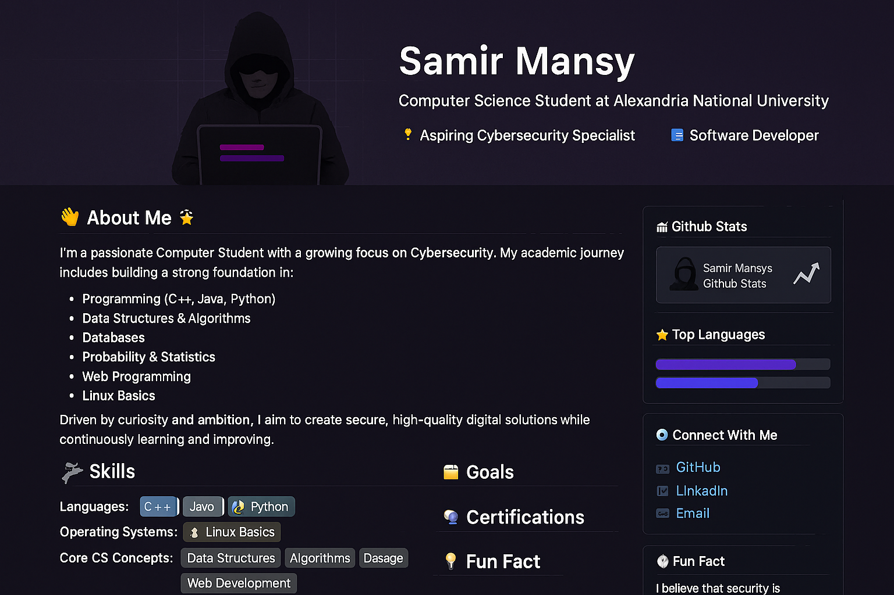

<!-- Banner Image -->

# 👋 Hi, I'm **Samir Mansy**  
🎓 **Computer Science Student** at **Alexandria National University**  
🔐 **Aspiring Cybersecurity Specialist** | 💻 **Software Developer**

---

## 🌟 About Me
I’m a passionate Computer Science student with a growing focus on **Cybersecurity**. My academic journey includes building a strong foundation in:

- **Programming** (C++, Java, Python)
- **Data Structures & Algorithms**
- **Databases**
- **Probability & Statistics**
- **Web Programming**
- **Linux Basics**

Driven by curiosity and ambition, I aim to create **secure, high-quality digital solutions** while continuously learning and improving.

---

## 🛠 Skills

**Core CS Concepts:** Data Structures | Algorithms | Database Design | Web Development

---

## 🎯 Goals
- Master advanced **Cybersecurity techniques**
- Contribute to **open-source projects**
- Build innovative and secure **software solutions**

---

## 📂 Programming Projects (Placeholders)
- [Advanced Data Structures](#)
- [Web Development Portfolio](#)

## 🔐 Cybersecurity Projects (Placeholders)
- [Penetration Testing Lab](#)
- [Secure Authentication System](#)

---

## 📫 Connect With Me

---

## 📊 GitHub Stats

### 🔥 Contribution Graph

### 👀 Profile Views

---

## 💡 Fun Fact
I believe that **security is not a feature—it’s a mindset**.
